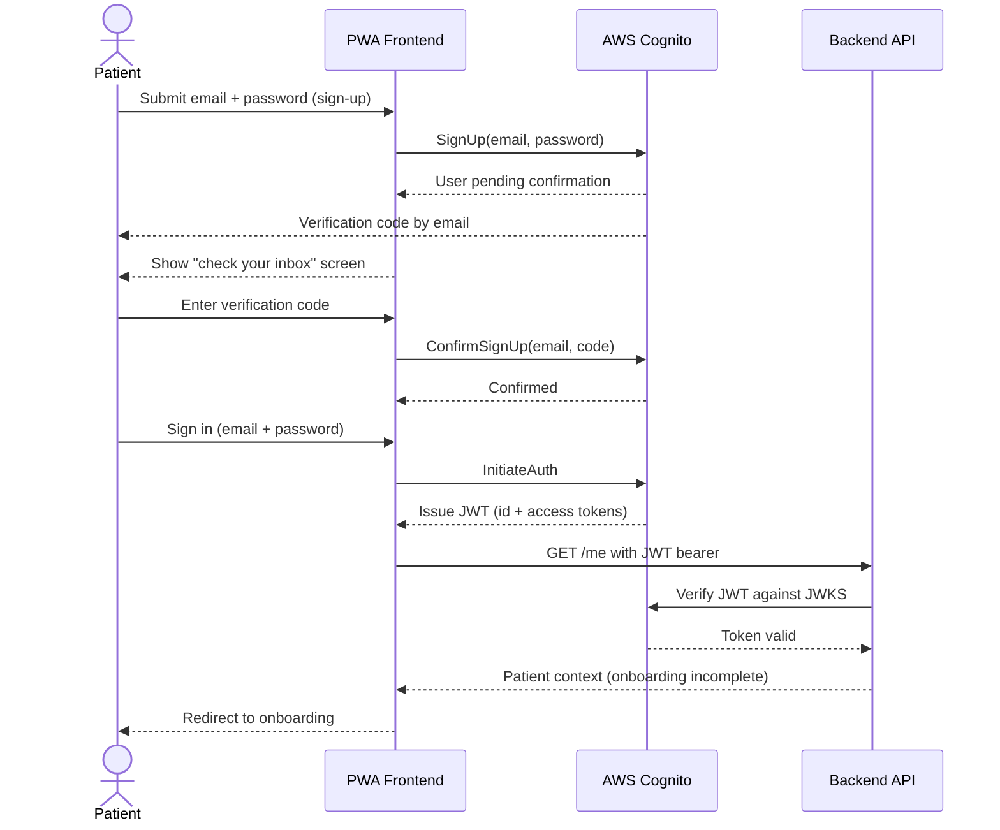

# How does a Patient create and confirm an account?

Covers `US-01-ONB` and `US-02-ONB`. Authentication is delegated to AWS Cognito; GlucoChef never stores credentials.

```mermaid
sequenceDiagram
    actor Patient
    participant PWA as PWA Frontend
    participant Cognito as AWS Cognito
    participant API as Backend API

    Patient->>PWA: Submit email + password (sign-up)
    PWA->>Cognito: SignUp(email, password)
    Cognito-->>PWA: User pending confirmation
    Cognito-->>Patient: Verification code by email
    PWA-->>Patient: Show "check your inbox" screen

    Patient->>PWA: Enter verification code
    PWA->>Cognito: ConfirmSignUp(email, code)
    Cognito-->>PWA: Confirmed

    Patient->>PWA: Sign in (email + password)
    PWA->>Cognito: InitiateAuth
    Cognito-->>PWA: Issue JWT (id + access tokens)
    PWA->>API: GET /me with JWT bearer
    API->>Cognito: Verify JWT against JWKS
    Cognito-->>API: Token valid
    API-->>PWA: Patient context (onboarding incomplete)
    PWA-->>Patient: Redirect to onboarding
```
