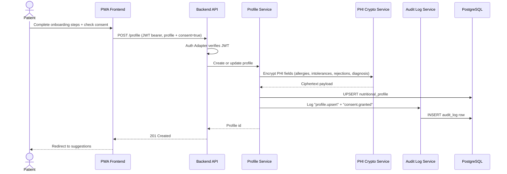

# How is the nutritional profile created with explicit consent?

Covers `US-04-ONB` and `US-03-SEC`. Submitting onboarding without consent is rejected; submitting with consent persists the profile and writes an audit row.

