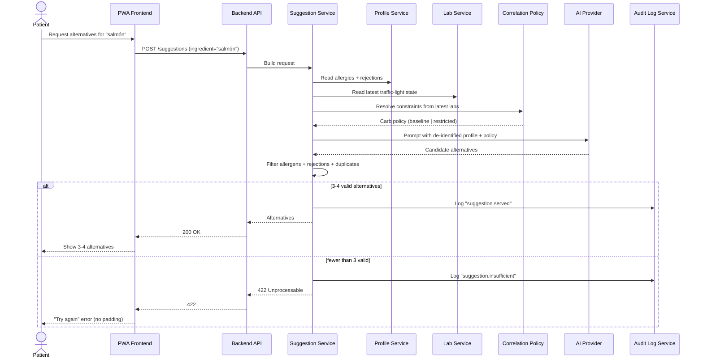

# How are allergy- and rejection-aware alternatives produced?

Covers `US-01-SUG` through `US-04-SUG`. The AI provider proposes candidates; the backend filters allergens and persisted rejections before returning a list to the patient. The system fails loudly when fewer than three valid alternatives remain.

