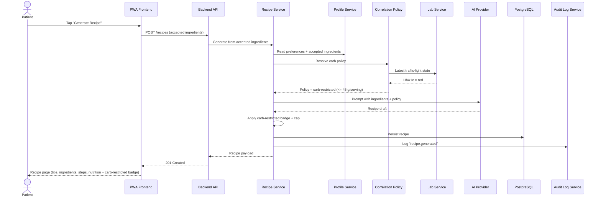

# How does a red HbA1c tighten the next recipe?

Covers `US-01-RCP`, `US-02-RCP`, and `US-01-COR`. The recipe service consults `Correlation Policy`, which reads the latest traffic-light state from `Lab Service` and decides whether the carb-restricted policy applies.

