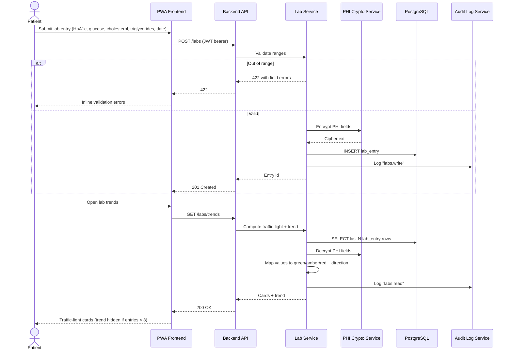

# How is a lab entry stored, interpreted, and audited?

Covers `US-01-LAB` through `US-04-LAB`, plus `US-01-SEC` and `US-04-SEC`. Values are validated, encrypted at the field level, persisted, and surfaced as traffic-light cards with a trend computed from the latest three entries.

