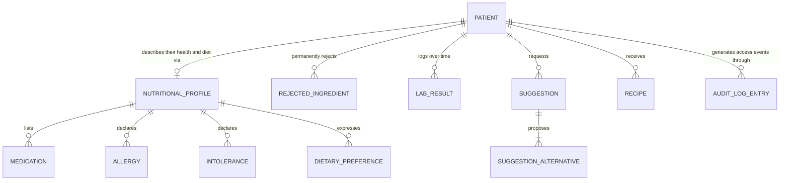

# Entity Relationship Diagram

**Status:** authoritative data model for the MVP.
**Conventions:** `skills/glucochef-data/SKILL.md`.
**Scope:** entities required by `docs/glucochef-prd.md` phases 3, 5, 6, 7, 9, 10, 11, 12, and the audit logging requirement from phase 5.

This document is produced in three layered models — conceptual, logical, physical — followed by a per-table entity catalogue. Each level builds strictly on the previous one. Do not skip ahead when reading.

### Note on table count vs. PRD phase 3

Phase 3 of the PRD mentions seven tables. The conventions in `skills/glucochef-data/SKILL.md` require splitting multi-valued attributes (medications, allergies, intolerances, dietary preferences) and AI suggestion outputs into child entities for 3NF compliance. The resulting MVP schema has **12 tables**. The PRD acceptance criterion ("all tables with correct foreign keys") still holds; only the count differs. This delta is recorded here as the canonical reference.

---

## Level 1 — Conceptual model

Business-facing view. Each block represents a domain concept. Relationships are described in plain language. No attributes, no types.

**Reading guide.**

- A patient has **at most one** nutritional profile (it is built during onboarding and updated in place).
- Medications, allergies, intolerances, and dietary preferences are **lists** that belong to a profile.
- A rejected ingredient is a permanent filter the patient applies to future suggestions.
- A lab result is a single clinical measurement entered manually by the patient.
- A suggestion is a request for alternatives to one ingredient; it always produces three to four alternatives.
- A recipe is generated on demand from accepted ingredients and the patient's latest clinical state.
- An audit log entry records every access to PHI; it is forensic and survives patient deletion.

---

## Level 2 — Logical model

Technology-agnostic structure. Attributes use logical types. 3NF applied: multi-valued attributes are extracted into child entities. PHI entities and attributes are marked `⚠ PHI`. No database types, no indexes, no encryption mechanism yet.

```mermaid
erDiagram
    PATIENT ||--o| NUTRITIONAL_PROFILE : has
    PATIENT ||--o{ REJECTED_INGREDIENT : rejects
    PATIENT ||--o{ LAB_RESULT : logs
    PATIENT ||--o{ SUGGESTION : requests
    PATIENT ||--o{ RECIPE : receives
    PATIENT ||--o{ AUDIT_LOG_ENTRY : observed_in

    NUTRITIONAL_PROFILE ||--o{ MEDICATION : lists
    NUTRITIONAL_PROFILE ||--o{ ALLERGY : declares
    NUTRITIONAL_PROFILE ||--o{ INTOLERANCE : declares
    NUTRITIONAL_PROFILE ||--o{ DIETARY_PREFERENCE : expresses

    SUGGESTION ||--|{ SUGGESTION_ALTERNATIVE : proposes

    PATIENT {
        identifier id PK
        string cognito_sub "unique; identifies the Cognito user"
        string display_name "optional; non-clinical"
        date date_of_birth
        string sex_at_birth "optional"
        boolean consent_accepted
        date consent_accepted_on
    }

    NUTRITIONAL_PROFILE {
        identifier id PK
        identifier patient_id FK
        string diabetes_type "⚠ PHI; type 1 | type 2 | gestational | prediabetes"
        date diagnosis_date "⚠ PHI; optional"
        text additional_notes "⚠ PHI; optional"
    }

    MEDICATION {
        identifier id PK
        identifier nutritional_profile_id FK
        string name "⚠ PHI"
        string dosage "⚠ PHI; optional"
    }

    ALLERGY {
        identifier id PK
        identifier nutritional_profile_id FK
        string substance "⚠ PHI"
        string severity "⚠ PHI; mild | moderate | severe"
    }

    INTOLERANCE {
        identifier id PK
        identifier nutritional_profile_id FK
        string substance "⚠ PHI"
    }

    DIETARY_PREFERENCE {
        identifier id PK
        identifier nutritional_profile_id FK
        string preference "cultural or dietary tag; not PHI on its own"
    }

    REJECTED_INGREDIENT {
        identifier id PK
        identifier patient_id FK
        string ingredient_normalized "⚠ PHI; lowercased, trimmed"
        string ingredient_display "⚠ PHI; as entered"
    }

    LAB_RESULT {
        identifier id PK
        identifier patient_id FK
        string kind "hba1c | fasting_glucose | total_cholesterol | triglycerides"
        decimal value "⚠ PHI"
        string unit "percent | mg_per_dl"
        date sample_date "⚠ PHI"
    }

    SUGGESTION {
        identifier id PK
        identifier patient_id FK
        string source_ingredient "⚠ PHI; the ingredient the patient asked to replace"
        string clinical_context_summary "derived traffic-light state at request time; status strings only"
    }

    SUGGESTION_ALTERNATIVE {
        identifier id PK
        identifier suggestion_id FK
        string ingredient "⚠ PHI"
        string rationale "non-clinical explanation surfaced to the patient"
        integer rank "1 to 4"
    }

    RECIPE {
        identifier id PK
        identifier patient_id FK
        string title
        text content "ingredients, steps, nutrition summary; ⚠ PHI by association"
        string clinical_context_summary "derived traffic-light state at generation time"
    }

    AUDIT_LOG_ENTRY {
        identifier id PK
        identifier patient_id FK "no cascade; survives patient deletion"
        string actor_cognito_sub
        string action "read | write | delete"
        string resource "labs | suggestions | recipes | onboarding | rejections"
        string resource_id "optional"
        string ip_address "PHI-adjacent; access-controlled, never logged elsewhere"
        timestamp event_at
    }
```

**Logical-model notes.**

- `nutritional_profile.diabetes_type` is PHI because it states the patient's clinical diagnosis. The same applies to medication, allergy, intolerance entries.
- `dietary_preference.preference` (e.g., "mediterranean", "low-sodium", "kosher") is not PHI on its own; it is a cultural or dietary choice.
- `suggestion.clinical_context_summary` and `recipe.clinical_context_summary` store **derived status strings** (e.g., `hba1c:red, triglycerides:amber`). They never contain raw numeric values — see anti-patterns in the data skill.
- `rejected_ingredient` keeps both a normalized form (used for uniqueness and exclusion logic) and a display form (used for UI rendering).
- The audit log is the only entity whose relationship to `patient` is **not** subject to cascade deletion: forensic rows must outlive the patient.

---

## Level 3 — Physical model (PostgreSQL)

PostgreSQL-specific implementation. PHI columns are stored as `TEXT` Fernet ciphertext via the `EncryptedString` SQLAlchemy type decorator (see PRD phase 5). The original logical type is recorded in the column comment. Surrogate primary keys are `UUID`. System timestamps are `TIMESTAMPTZ`; clinical sample dates are `DATE`. The `audit_log_entries` table is exempt from PHI encryption rules for the columns required to remain queryable (forensic posture); see the entity catalogue for details.

```mermaid
erDiagram
    patients ||--o| nutritional_profiles : has
    patients ||--o{ rejected_ingredients : rejects
    patients ||--o{ lab_results : logs
    patients ||--o{ suggestions : requests
    patients ||--o{ recipes : receives
    patients ||--o{ audit_log_entries : observed_in

    nutritional_profiles ||--o{ medications : lists
    nutritional_profiles ||--o{ allergies : declares
    nutritional_profiles ||--o{ intolerances : declares
    nutritional_profiles ||--o{ dietary_preferences : expresses

    suggestions ||--|{ suggestion_alternatives : proposes

    patients {
        UUID id PK "DEFAULT gen_random_uuid()"
        VARCHAR cognito_sub "NOT NULL UNIQUE"
        VARCHAR display_name "NULL"
        DATE date_of_birth "NULL"
        VARCHAR sex_at_birth "NULL"
        BOOLEAN consent_accepted "NOT NULL DEFAULT false"
        DATE consent_accepted_on "NULL"
        TIMESTAMPTZ created_at "NOT NULL DEFAULT now()"
        TIMESTAMPTZ updated_at "NOT NULL DEFAULT now()"
        TIMESTAMPTZ deleted_at "NULL"
    }

    nutritional_profiles {
        UUID id PK "DEFAULT gen_random_uuid()"
        UUID patient_id FK "NOT NULL UNIQUE; ON DELETE CASCADE"
        TEXT diabetes_type "⚠ PHI · EncryptedString · logical: string"
        TEXT diagnosis_date "⚠ PHI · EncryptedString · logical: date"
        TEXT additional_notes "⚠ PHI · EncryptedString · logical: text"
        TIMESTAMPTZ created_at "NOT NULL DEFAULT now()"
        TIMESTAMPTZ updated_at "NOT NULL DEFAULT now()"
    }

    medications {
        UUID id PK "DEFAULT gen_random_uuid()"
        UUID nutritional_profile_id FK "NOT NULL; ON DELETE CASCADE"
        TEXT name "⚠ PHI · EncryptedString · logical: string"
        TEXT dosage "⚠ PHI · EncryptedString · logical: string"
        TIMESTAMPTZ created_at "NOT NULL DEFAULT now()"
    }

    allergies {
        UUID id PK "DEFAULT gen_random_uuid()"
        UUID nutritional_profile_id FK "NOT NULL; ON DELETE CASCADE"
        TEXT substance "⚠ PHI · EncryptedString · logical: string"
        TEXT severity "⚠ PHI · EncryptedString · logical: string"
        TIMESTAMPTZ created_at "NOT NULL DEFAULT now()"
    }

    intolerances {
        UUID id PK "DEFAULT gen_random_uuid()"
        UUID nutritional_profile_id FK "NOT NULL; ON DELETE CASCADE"
        TEXT substance "⚠ PHI · EncryptedString · logical: string"
        TIMESTAMPTZ created_at "NOT NULL DEFAULT now()"
    }

    dietary_preferences {
        UUID id PK "DEFAULT gen_random_uuid()"
        UUID nutritional_profile_id FK "NOT NULL; ON DELETE CASCADE"
        VARCHAR preference "NOT NULL"
        TIMESTAMPTZ created_at "NOT NULL DEFAULT now()"
    }

    rejected_ingredients {
        UUID id PK "DEFAULT gen_random_uuid()"
        UUID patient_id FK "NOT NULL; ON DELETE CASCADE"
        TEXT ingredient_normalized "⚠ PHI · EncryptedString · logical: string"
        TEXT ingredient_display "⚠ PHI · EncryptedString · logical: string"
        TIMESTAMPTZ created_at "NOT NULL DEFAULT now()"
    }

    lab_results {
        UUID id PK "DEFAULT gen_random_uuid()"
        UUID patient_id FK "NOT NULL; ON DELETE CASCADE"
        lab_kind kind "NOT NULL"
        TEXT value "⚠ PHI · EncryptedString · logical: decimal"
        lab_unit unit "NOT NULL"
        DATE sample_date "NOT NULL"
        TIMESTAMPTZ created_at "NOT NULL DEFAULT now()"
    }

    suggestions {
        UUID id PK "DEFAULT gen_random_uuid()"
        UUID patient_id FK "NOT NULL; ON DELETE CASCADE"
        TEXT source_ingredient "⚠ PHI · EncryptedString · logical: string"
        JSONB clinical_context_summary "status strings only; no numeric PHI"
        TIMESTAMPTZ created_at "NOT NULL DEFAULT now()"
    }

    suggestion_alternatives {
        UUID id PK "DEFAULT gen_random_uuid()"
        UUID suggestion_id FK "NOT NULL; ON DELETE CASCADE"
        TEXT ingredient "⚠ PHI · EncryptedString · logical: string"
        TEXT rationale "⚠ PHI · EncryptedString · logical: text"
        SMALLINT rank "NOT NULL; CHECK (rank BETWEEN 1 AND 4)"
        TIMESTAMPTZ created_at "NOT NULL DEFAULT now()"
    }

    recipes {
        UUID id PK "DEFAULT gen_random_uuid()"
        UUID patient_id FK "NOT NULL; ON DELETE CASCADE"
        VARCHAR title "NOT NULL"
        JSONB content "NOT NULL; immutable AI artifact"
        JSONB clinical_context_summary "status strings only; no numeric PHI"
        TIMESTAMPTZ created_at "NOT NULL DEFAULT now()"
    }

    audit_log_entries {
        UUID id PK "DEFAULT gen_random_uuid()"
        UUID patient_id FK "NULL on hard ref break; NO CASCADE"
        VARCHAR actor_cognito_sub "NOT NULL"
        audit_action action "NOT NULL"
        audit_resource resource "NOT NULL"
        UUID resource_id "NULL"
        INET ip_address "NULL; access-controlled"
        TIMESTAMPTZ event_at "NOT NULL DEFAULT now()"
    }
```

**Custom ENUM types** (declared in `backend/app/models/enums.py` and created via Alembic before the tables that reference them):

- `lab_kind`: `'hba1c' | 'fasting_glucose' | 'total_cholesterol' | 'triglycerides'`
- `lab_unit`: `'percent' | 'mg_per_dl'`
- `audit_action`: `'read' | 'write' | 'delete'`
- `audit_resource`: `'onboarding' | 'labs' | 'suggestions' | 'recipes' | 'rejections'`

**Global physical-model rules.**

- Every table has `created_at TIMESTAMPTZ NOT NULL DEFAULT now()`. Mutable tables (`patients`, `nutritional_profiles`) also have `updated_at TIMESTAMPTZ NOT NULL DEFAULT now()` maintained by the application layer (or by SQLAlchemy `onupdate=func.now()`).
- `patients.deleted_at TIMESTAMPTZ` is the soft-delete marker. Right-to-erasure: hard-delete all PHI child rows first, then set `deleted_at` on the patient row. The `audit_log_entries` FK to `patients` has **no** `ON DELETE CASCADE` and is intentionally allowed to dangle (or be nulled) so forensic rows survive.
- Encrypted columns (`TEXT` ciphertext) are never indexed and never carry DB-level `UNIQUE`. Uniqueness — including the `(patient_id, ingredient_normalized)` rule from PRD phase 7 — is enforced in the repository layer after decryption.
- JSONB is used only for AI-generated immutable artifacts (`recipes.content`) and for `clinical_context_summary` payloads that store derived **status strings** (e.g., `{"hba1c":"red","triglycerides":"amber"}`). Numeric PHI is never embedded in JSONB.

---

## Entity catalogue

One section per physical table. Columns reflect the Level 3 diagram. Indexes follow the rule: cover the most frequent lookup predicate and any `ORDER BY` used in trend or paginated reads.

### `patients`

Root entity for every individual using GlucoChef. Identified by `cognito_sub` (the Cognito user's `sub` claim); email is **not** stored here — it lives in Cognito.

**Columns.**

- `id UUID PK DEFAULT gen_random_uuid()`
- `cognito_sub VARCHAR(255) NOT NULL UNIQUE`
- `display_name VARCHAR(120) NULL`
- `date_of_birth DATE NULL`
- `sex_at_birth VARCHAR(20) NULL`
- `consent_accepted BOOLEAN NOT NULL DEFAULT false`
- `consent_accepted_on DATE NULL`
- `created_at TIMESTAMPTZ NOT NULL DEFAULT now()`
- `updated_at TIMESTAMPTZ NOT NULL DEFAULT now()`
- `deleted_at TIMESTAMPTZ NULL`

**Constraints.** `UNIQUE (cognito_sub)`; `CHECK (consent_accepted = false OR consent_accepted_on IS NOT NULL)`.

**Indexes.** `idx_patients_cognito_sub` (covered by `UNIQUE`); partial `idx_patients_active ON patients(id) WHERE deleted_at IS NULL` for active-patient lookups.

**Notes.** No PHI stored in this table by design — diagnosis lives in `nutritional_profiles`.

---

### `nutritional_profiles`

One per patient. Captures the diagnosis context produced during onboarding (PRD phase 6).

**Columns.**

- `id UUID PK DEFAULT gen_random_uuid()`
- `patient_id UUID NOT NULL UNIQUE REFERENCES patients(id) ON DELETE CASCADE`
- `diabetes_type TEXT NULL` — ⚠ PHI · `EncryptedString` · logical: `string` (`type 1 | type 2 | gestational | prediabetes`)
- `diagnosis_date TEXT NULL` — ⚠ PHI · `EncryptedString` · logical: `date`
- `additional_notes TEXT NULL` — ⚠ PHI · `EncryptedString` · logical: `text`
- `created_at TIMESTAMPTZ NOT NULL DEFAULT now()`
- `updated_at TIMESTAMPTZ NOT NULL DEFAULT now()`

**Constraints.** `UNIQUE (patient_id)` enforces the 1:1 cardinality.

**Indexes.** Covered by the unique FK.

**Notes.** Posting onboarding twice for the same patient updates this row in place (PRD phase 6 acceptance criterion).

---

### `medications`

Child of `nutritional_profiles`. Multi-valued by design — splitting out is mandated by 3NF.

**Columns.**

- `id UUID PK DEFAULT gen_random_uuid()`
- `nutritional_profile_id UUID NOT NULL REFERENCES nutritional_profiles(id) ON DELETE CASCADE`
- `name TEXT NOT NULL` — ⚠ PHI · `EncryptedString` · logical: `string`
- `dosage TEXT NULL` — ⚠ PHI · `EncryptedString` · logical: `string`
- `created_at TIMESTAMPTZ NOT NULL DEFAULT now()`

**Indexes.** `idx_medications_profile ON medications(nutritional_profile_id)`.

**Notes.** No DB-level uniqueness on `name`; deduplication, if needed, happens in the repository layer after decryption.

---

### `allergies`

Child of `nutritional_profiles`. Severity drives prompt-time guardrails for the AI provider.

**Columns.**

- `id UUID PK DEFAULT gen_random_uuid()`
- `nutritional_profile_id UUID NOT NULL REFERENCES nutritional_profiles(id) ON DELETE CASCADE`
- `substance TEXT NOT NULL` — ⚠ PHI · `EncryptedString` · logical: `string`
- `severity TEXT NOT NULL` — ⚠ PHI · `EncryptedString` · logical: `string` (`mild | moderate | severe`)
- `created_at TIMESTAMPTZ NOT NULL DEFAULT now()`

**Indexes.** `idx_allergies_profile ON allergies(nutritional_profile_id)`.

**Notes.** An allergic substance is always excluded from suggestion alternatives (PRD phase 9 acceptance criterion).

---

### `intolerances`

Child of `nutritional_profiles`. Distinct from allergies because the clinical handling differs (severity is not modelled).

**Columns.**

- `id UUID PK DEFAULT gen_random_uuid()`
- `nutritional_profile_id UUID NOT NULL REFERENCES nutritional_profiles(id) ON DELETE CASCADE`
- `substance TEXT NOT NULL` — ⚠ PHI · `EncryptedString` · logical: `string`
- `created_at TIMESTAMPTZ NOT NULL DEFAULT now()`

**Indexes.** `idx_intolerances_profile ON intolerances(nutritional_profile_id)`.

---

### `dietary_preferences`

Child of `nutritional_profiles`. **Not PHI**: cultural and dietary tags (e.g., `mediterranean`, `low-sodium`, `vegetarian`) do not by themselves indicate a clinical condition.

**Columns.**

- `id UUID PK DEFAULT gen_random_uuid()`
- `nutritional_profile_id UUID NOT NULL REFERENCES nutritional_profiles(id) ON DELETE CASCADE`
- `preference VARCHAR(80) NOT NULL`
- `created_at TIMESTAMPTZ NOT NULL DEFAULT now()`

**Constraints.** `UNIQUE (nutritional_profile_id, preference)` — no need to repository-enforce because the column is not encrypted.

**Indexes.** Covered by the composite unique constraint.

---

### `rejected_ingredients`

Persistent rejection filter applied to every future suggestion (PRD phase 7).

**Columns.**

- `id UUID PK DEFAULT gen_random_uuid()`
- `patient_id UUID NOT NULL REFERENCES patients(id) ON DELETE CASCADE`
- `ingredient_normalized TEXT NOT NULL` — ⚠ PHI · `EncryptedString` · logical: `string` (lowercased, trimmed)
- `ingredient_display TEXT NOT NULL` — ⚠ PHI · `EncryptedString` · logical: `string`
- `created_at TIMESTAMPTZ NOT NULL DEFAULT now()`

**Constraints.** No DB-level uniqueness (ciphertext). Uniqueness `(patient_id, ingredient_normalized)` is enforced in the repository layer by decrypting and comparing the normalized form. This matches PRD phase 7 acceptance criterion ("salmón" and "Salmón " collapse to one row).

**Indexes.** `idx_rejected_ingredients_patient ON rejected_ingredients(patient_id)`.

---

### `lab_results`

Manual lab entries (PRD phase 11). The kind/unit pair is constrained to the four canonical lab types of the MVP.

**Columns.**

- `id UUID PK DEFAULT gen_random_uuid()`
- `patient_id UUID NOT NULL REFERENCES patients(id) ON DELETE CASCADE`
- `kind lab_kind NOT NULL`
- `value TEXT NOT NULL` — ⚠ PHI · `EncryptedString` · logical: `decimal`
- `unit lab_unit NOT NULL`
- `sample_date DATE NOT NULL`
- `created_at TIMESTAMPTZ NOT NULL DEFAULT now()`

**Constraints.** `CHECK ((kind = 'hba1c' AND unit = 'percent') OR (kind <> 'hba1c' AND unit = 'mg_per_dl'))` — keeps each lab kind locked to its expected unit.

**Indexes.**

- `idx_lab_results_patient_sample_date ON lab_results(patient_id, sample_date DESC)` — supports the latest-N queries used by `GET /labs/trends` (PRD phase 12).
- `idx_lab_results_patient_kind ON lab_results(patient_id, kind, sample_date DESC)` — supports per-kind trend computation.

**Notes.** Clinical thresholds (green/amber/red bands) are **not** stored in the schema; they live as constants under `backend/app/services/` per the data skill anti-pattern list.

---

### `suggestions`

One row per call to `POST /suggestions` (PRD phase 9). Persisted to support auditing and the AI usage log; the API still returns the alternatives synchronously.

**Columns.**

- `id UUID PK DEFAULT gen_random_uuid()`
- `patient_id UUID NOT NULL REFERENCES patients(id) ON DELETE CASCADE`
- `source_ingredient TEXT NOT NULL` — ⚠ PHI · `EncryptedString` · logical: `string`
- `clinical_context_summary JSONB NOT NULL DEFAULT '{}'::jsonb` — derived status strings only (e.g., `{"hba1c":"red"}`)
- `created_at TIMESTAMPTZ NOT NULL DEFAULT now()`

**Indexes.** `idx_suggestions_patient_created_at ON suggestions(patient_id, created_at DESC)`.

**Notes.** `clinical_context_summary` must never contain raw lab values; only the colour status produced by `app/services/labs.py::evaluate` (anti-pattern in the data skill).

---

### `suggestion_alternatives`

Child of `suggestions`. The 3–4 alternatives returned for each suggestion request.

**Columns.**

- `id UUID PK DEFAULT gen_random_uuid()`
- `suggestion_id UUID NOT NULL REFERENCES suggestions(id) ON DELETE CASCADE`
- `ingredient TEXT NOT NULL` — ⚠ PHI · `EncryptedString` · logical: `string`
- `rationale TEXT NOT NULL` — ⚠ PHI · `EncryptedString` · logical: `text`
- `rank SMALLINT NOT NULL`
- `created_at TIMESTAMPTZ NOT NULL DEFAULT now()`

**Constraints.** `CHECK (rank BETWEEN 1 AND 4)`; `UNIQUE (suggestion_id, rank)`.

**Indexes.** Covered by the composite unique constraint.

**Notes.** The 3–4 count is enforced in the application layer; if the provider returns fewer than 3 the request fails with HTTP 502 (PRD phase 9).

---

### `recipes`

On-demand AI-generated recipes (PRD phase 10). `content` is an immutable JSON artifact — this is the documented exception to the "no JSONB for clinical data" rule (see the data skill).

**Columns.**

- `id UUID PK DEFAULT gen_random_uuid()`
- `patient_id UUID NOT NULL REFERENCES patients(id) ON DELETE CASCADE`
- `title VARCHAR(200) NOT NULL`
- `content JSONB NOT NULL` — `{ ingredients: [...], steps: [...], nutrition_summary: {...} }`
- `clinical_context_summary JSONB NOT NULL DEFAULT '{}'::jsonb` — derived status strings only
- `created_at TIMESTAMPTZ NOT NULL DEFAULT now()`

**Indexes.** `idx_recipes_patient_created_at ON recipes(patient_id, created_at DESC)`.

**Notes.** `content` is treated as PHI-by-association: served only through audited endpoints (PRD phase 5) and never sent to the AI provider for re-processing. The decision to use JSONB here must be recorded in `memory-bank/decisions.md` per the data skill.

---

### `audit_log_entries`

Forensic record of every PHI access. Required by the security baseline in `skills/glucochef-conventions/SKILL.md`.

**Columns.**

- `id UUID PK DEFAULT gen_random_uuid()`
- `patient_id UUID NULL REFERENCES patients(id)` — **no** `ON DELETE CASCADE`; nullable so the FK can be relaxed if a patient is hard-deleted by an external compliance process
- `actor_cognito_sub VARCHAR(255) NOT NULL`
- `action audit_action NOT NULL`
- `resource audit_resource NOT NULL`
- `resource_id UUID NULL`
- `ip_address INET NULL`
- `event_at TIMESTAMPTZ NOT NULL DEFAULT now()`

**Indexes.**

- `idx_audit_patient_event_at ON audit_log_entries(patient_id, event_at DESC)` — supports per-patient access review.
- `idx_audit_event_at ON audit_log_entries(event_at DESC)` — supports global forensic queries.

**Notes.**

- Right-to-erasure exemption: rows in this table are **not** removed when a patient is deleted. The FK is intentionally cascade-free.
- `ip_address` is the only place IP addresses are persisted. Application logs must not capture client IPs (anti-pattern in the data skill).
- This table never contains encrypted PHI columns; the resource being accessed is referenced by id, not by value, so no clinical content lives here.

---

## Cross-cutting concerns

### PHI inventory (Level 3)

| Table | Encrypted columns |
|---|---|
| `nutritional_profiles` | `diabetes_type`, `diagnosis_date`, `additional_notes` |
| `medications` | `name`, `dosage` |
| `allergies` | `substance`, `severity` |
| `intolerances` | `substance` |
| `rejected_ingredients` | `ingredient_normalized`, `ingredient_display` |
| `lab_results` | `value` |
| `suggestions` | `source_ingredient` |
| `suggestion_alternatives` | `ingredient`, `rationale` |

`recipes.content` is JSONB and treated as PHI-by-association at the access-control layer rather than at the storage layer; rationale lives in `memory-bank/decisions.md` (to be recorded alongside the JSONB usage decision).

### Right-to-erasure order (canonical sequence)

1. Delete all rows in: `suggestion_alternatives` (via cascade from `suggestions`), `suggestions`, `recipes`, `lab_results`, `rejected_ingredients`, `medications`, `allergies`, `intolerances`, `dietary_preferences`, `nutritional_profiles`.
2. Set `patients.deleted_at = now()` (soft-delete the root).
3. Leave `audit_log_entries` untouched; if external compliance requires breaking the FK, set `patient_id = NULL` rather than deleting the row.

### Alembic mapping

Per the data skill, one migration per PRD phase:

- Phase 3 migration creates `patients`, `nutritional_profiles`, `medications`, `allergies`, `intolerances`, `dietary_preferences`, `rejected_ingredients`, `lab_results`, `suggestions`, `suggestion_alternatives`, `recipes`, `audit_log_entries` together with the four ENUM types. PHI columns use the placeholder `EncryptedString` from PRD phase 3.
- Phase 5 migration swaps the placeholder for the real Fernet-backed `EncryptedString` `TypeDecorator` and adds the audit log helper plumbing.
- Phase 7 migration adds nothing structural (uniqueness is repository-layer) but ships any seed or index tuning revealed by integration tests.

Each migration ships a reversible `downgrade()`; seed data never contains plaintext PHI.
