## Índice

0. [Ficha del proyecto](#0-ficha-del-proyecto)
1. [Descripción general del producto](#1-descripción-general-del-producto)
2. [Arquitectura del sistema](#2-arquitectura-del-sistema)
3. [Modelo de datos](#3-modelo-de-datos)
4. [Especificación de la API](#4-especificación-de-la-api)
5. [Historias de usuario](#5-historias-de-usuario)
6. [Tickets de trabajo](#6-tickets-de-trabajo)
7. [Pull requests](#7-pull-requests)

---

## 0. Ficha del proyecto

### **0.1. Tu nombre completo:**
Luis Ovando

### **0.2. Nombre del proyecto:**
GlucoChef

### **0.3. Descripción breve del proyecto:**
GlucoChef es una Progressive Web App (PWA) mobile-first que ayuda a pacientes adultos con diabetes tipo 1, tipo 2 o gestacional a tomar decisiones alimentarias concretas cada día. Combina un motor de sugerencias de ingredientes personalizadas (con alternativas equivalentes que respetan alergias y rechazos), generación de recetas bajo demanda a partir de los ingredientes aceptados, y un registro de laboratorios con interpretación en semáforo. Los valores clínicos modulan las recomendaciones nutricionales, cerrando el ciclo dieta–clínica que ninguna app existente ofrece.

### **0.4. URL del proyecto:**

> Puede ser pública o privada, en cuyo caso deberás compartir los accesos de manera segura. Puedes enviarlos a [alvaro@lidr.co](mailto:alvaro@lidr.co) usando algún servicio como [onetimesecret](https://onetimesecret.com/).

### 0.5. URL o archivo comprimido del repositorio

> Puedes tenerlo alojado en público o en privado, en cuyo caso deberás compartir los accesos de manera segura. Puedes enviarlos a [alvaro@lidr.co](mailto:alvaro@lidr.co) usando algún servicio como [onetimesecret](https://onetimesecret.com/). También puedes compartir por correo un archivo zip con el contenido


---

## 1. Descripción general del producto

### **1.1. Objetivo:**

Los pacientes con diabetes enfrentan dos problemas sin resolver en el mismo día: decidir qué comer y entender sus resultados de laboratorio. Las apps existentes rastrean glucosa de forma aislada (mySugr, Glucose Buddy) o muestran catálogos genéricos de recetas (Klinio), y ninguna conecta las decisiones alimentarias con la evolución clínica.

**GlucoChef** ocupa ese espacio con tres capacidades interconectadas:

1. **Sugerencias de ingredientes personalizadas** — el sistema propone 3–4 alternativas nutricionalmente equivalentes por ingrediente, > respetando alergias, intolerancias y rechazos previos. Los ingredientes rechazados nunca vuelven a aparecer.
2. **Generación de recetas bajo demanda** — las recetas se construyen a partir de los ingredientes que el paciente aceptó, no de un catálogo fijo, maximizando la adherencia.
3. **Seguimiento de laboratorios y correlación clínica** — el paciente registra HbA1c, glucosa en ayuno, colesterol y triglicéridos en un formulario guiado. Cada entrada se evalúa con umbrales clínicos de la ADA (verde / ámbar / rojo) y se calcula la tendencia de las últimas tres entradas. Los valores en rojo ajustan automáticamente la guía de carbohidratos en el próximo ciclo de recomendaciones.

El producto apunta a pacientes adultos (18+) con cualquier subtipo de diabetes, opera dentro del AWS Free Tier y demuestra prácticas alineadas con HIPAA (cifrado AES-256 por campo, RBAC, registro de auditoría, consentimiento explícito) sin buscar certificación formal.

### **1.2. Características y funcionalidades principales:**


| Funcionalidad | Descripción | Valor para el usuario |
|---|---|---|
| **Onboarding nutricional** | Formulario guiado multi-paso: tipo de diabetes, medicación, alergias, intolerancias, alimentos rechazados y preferencias culturales | Personaliza cada recomendación posterior desde el primer día |
| **Motor de sugerencias con alternativas** | La IA propone 3–4 alternativas nutricionalmente equivalentes por ingrediente; los rechazos se persisten y nunca se vuelven a sugerir | Sustituye el consejo genérico por opciones que el paciente realmente puede y quiere comer |
| **Generación de recetas bajo demanda** | Recetas generadas a partir de los ingredientes aceptados + contexto clínico más reciente, no de un catálogo estático | El paciente come lo que reconoce y le gusta, aumentando la adherencia |
| **Registro de laboratorios** | Formulario guiado para HbA1c, glucosa en ayuno, colesterol total y triglicéridos, con validación de rangos | Captura estructurada de datos clínicos sin depender de parseo de PDFs |
| **Visualización de tendencias** | Lecturas verde / ámbar / rojo con interpretación en lenguaje llano y gráfica de tendencias sobre las últimas 6 entradas | El paciente entiende sus números sin necesitar al médico en el ciclo |
| **Correlación dieta–clínica** | El estado del semáforo más reciente modula los prompts de IA (ej. HbA1c en rojo restringe la densidad de carbohidratos) | Cierra el ciclo entre lo que el paciente come y cómo evolucionan sus indicadores |
| **PWA / mobile-first** | Instalable desde el navegador, pantalla completa sin barra de dirección, splash screen, ícono en home screen | Experiencia de app nativa sin fricción de App Store ni pipeline de build separado |
| **Prácticas alineadas con HIPAA** | AES-256 en reposo en campos PHI, TLS 1.2+ en tránsito, RBAC en endpoints PHI, audit log, consentimiento explícito en onboarding | Demuestra gestión responsable de datos de salud, apropiada para una entrega académica |

**Funcionalidades diferidas a v2:**

| Funcionalidad | Motivo del diferimiento |
|---|---|
| Carga de PDF de laboratorios | Los formatos de PDF varían significativamente entre laboratorios; el riesgo técnico supera el presupuesto de 30 horas |
| Plan semanal completo de 7 días | El balanceo nutricional multi-día requiere una capa de optimización separada |
| Feedback loop inteligente | Aprender de rechazos y valoraciones requiere datos acumulados y un harness de evaluación |
| Lista de compras | Meta secundaria; se incluye solo si el tiempo lo permite tras cumplir los criterios de aceptación principales |
| Roles multi-usuario (vista de nutriólogo/médico) | Añade una segunda persona y un track de UX que no cabe en el timeline del MVP |

### **1.3. Diseño y experiencia de usuario:**

> Proporciona imágenes y/o videotutorial mostrando la experiencia del usuario desde que aterriza en la aplicación, pasando por todas las funcionalidades principales.

### **1.4. Instrucciones de instalación:**

#### Requisitos previos

| Herramienta | Versión mínima | Verificar |
|---|---|---|
| Python | 3.11 | `python3 --version` |
| Node.js | 18 | `node --version` |
| pnpm | 8 | `pnpm --version` |
| Docker + Docker Compose | 24 | `docker --version` |

#### 1. Clonar el repositorio

```bash
git clone <repo-url>
cd glucochef
```

#### 2. Variables de entorno

Cada capa tiene su propio archivo de configuración:

```bash
# Credenciales de PostgreSQL para Docker Compose
cp .env.example .env

# Variables de runtime del backend
cp backend/.env.example backend/.env

# Variables de runtime del frontend
cp frontend/.env.example frontend/.env.local
```

Editar cada archivo y reemplazar los valores `change_me` y `REPLACE_WITH_*` con los valores reales.
Para la clave de cifrado PHI (Phase 5):

```bash
python3 -c "from cryptography.fernet import Fernet; print(Fernet.generate_key().decode())"
```

#### 3. Base de datos

```bash
# Levantar PostgreSQL (usa las credenciales del .env raíz)
docker compose up -d postgres

# Esperar a que el healthcheck pase (~5 s) y aplicar migraciones
cd backend
python3 -m venv .venv
source .venv/bin/activate        # Windows: .venv\Scripts\activate
pip install -e ".[dev]"
alembic upgrade head
```

#### 4. Backend

```bash
# Desde backend/ con el .venv activo
uvicorn app.main:app --reload
# → http://localhost:8000
# → http://localhost:8000/docs  (Swagger UI)
```

#### 5. Frontend

```bash
cd frontend
pnpm install
pnpm dev
# → http://localhost:3000
```

#### 6. Suite de tests

```bash
# Backend (desde backend/ con el .venv activo)
pytest

# Frontend — E2E con Playwright (Phase 23+)
pnpm exec playwright test
```

---

## 2. Arquitectura del Sistema

La arquitectura está documentada con el modelo C4 en tres niveles. Para renderizar los diagramas localmente:

```bash
npx -y dev docs/architecture/glucochef.c4
```

### **2.1. Diagrama de arquitectura:**
GlucoChef sigue una arquitectura de tres capas estándar (presentación → API → base de datos) con dos capas transversales específicas para datos de salud: cifrado por campo vía un `TypeDecorator` de SQLAlchemy que mantiene la protección de PHI invisible para los route handlers, y un registro de auditoría inyectado como dependencia FastAPI a nivel de ruta para que no pueda omitirse accidentalmente.

**Decisiones arquitectónicas clave:**

| Decisión | Justificación |
|---|---|
| **AWS Cognito para autenticación** | Externaliza el almacenamiento de credenciales y la política de contraseñas; la validación JWT es stateless en el backend |
| **AI Provider como interfaz** | Desacopla los route handlers del proveedor concreto; cambiar OpenAI ↔ Claude requiere modificar un solo archivo |
| **PWA en lugar de React Native** | Entrega experiencia de app nativa (instalable, sin barra de dirección) manteniendo el stack web completo y un CI/CD directo dentro del presupuesto de 30 horas |
| **Cifrado por campo (no solo de disco)** | Un snapshot de RDS filtrado no expone PHI aunque no tenga cifrado de disco; la clave de la aplicación es el único camino de descifrado |
| **JWT en cookie `httpOnly`** | Previene el robo de tokens por XSS; sin `localStorage` |

**Compromisos aceptados:**
- `db.t3.micro` está dimensionado para una demo académica, no para escala productiva.
- La latencia de cold-start de ECS Fargate / App Runner puede ser perceptible tras períodos de inactividad en la capa gratuita.


### **2.2. Descripción de componentes principales:**

| Componente | Tecnología | Responsabilidad |
|---|---|---|
| **Next.js PWA** | Next.js 14 App Router · TypeScript · Tailwind CSS | UI mobile-first. Instalable desde el navegador. Gestiona la sesión de Cognito mediante cookie `httpOnly` a través de un Route Handler. El service worker excluye explícitamente las rutas PHI del caché. |
| **FastAPI Backend** | Python 3.11 · FastAPI · SQLAlchemy 2.x · asyncpg | API REST. Valida JWT de Cognito. Orquesta las llamadas a IA. Aplica cifrado por campo en PHI antes de escribir. Emite entrada de audit log en cada lectura y escritura de PHI. |
| **PostgreSQL** | AWS RDS · db.t3.micro | Almacén persistente. Columnas PHI almacenadas como ciphertext Fernet (TEXT). Tabla `audit_log_entries` append-only sin cascade deletes. |
| **AWS Cognito** | Servicio de identidad gestionado | Maneja registro, verificación de correo, emisión de JWT y publicación de JWKS. Las credenciales nunca tocan el código de la aplicación. |
| **AI Provider** | OpenAI o Anthropic Claude API (se decide en la Fase 8) | Recibe prompts estructurados (tipo de diabetes, nivel de restricción de carbohidratos, ingredientes excluidos). El PHI crudo nunca se reenvía. |
| **GitHub Actions** | CI/CD | Tests de backend, build de frontend, E2E con Playwright y auditoría PWA con Lighthouse en cada PR. Deploy a AWS en push a `main`. |

### **2.3. Descripción de alto nivel del proyecto y estructura de ficheros**

> Representa la estructura del proyecto y explica brevemente el propósito de las carpetas principales, así como si obedece a algún patrón o arquitectura específica.

### **2.4. Infraestructura y despliegue**

> Detalla la infraestructura del proyecto, incluyendo un diagrama en el formato que creas conveniente, y explica el proceso de despliegue que se sigue

### **2.5. Seguridad**

| Práctica | Decisión de diseño |
|---|---|
| **Cifrado en reposo (PHI)** | Todas las columnas PHI se almacenan como ciphertext Fernet mediante un `TypeDecorator` de SQLAlchemy. Un dump de base de datos filtrado no puede leerse sin la clave de cifrado de la aplicación. |
| **Cifrado en tránsito** | TLS 1.2+ extremo a extremo: navegador → CDN → App Runner → RDS (`sslmode=require`). |
| **Autenticación** | AWS Cognito emite JWT. El backend valida cada petición contra el JWKS de Cognito. Token expirado o malformado → 401. |
| **Almacenamiento de sesión** | JWT en cookie `httpOnly` establecida por un Route Handler de Next.js. Sin `localStorage`. |
| **RBAC** | Dependencia `get_current_patient` en cada endpoint PHI. Peticiones sin autenticar o entre pacientes → 401 / 403. |
| **Audit logging** | Fila `AuditLogEntry` en cada lectura y escritura de PHI. Tabla append-only; sin cascade deletes. |
| **Consentimiento explícito** | El onboarding se bloquea hasta que el paciente marca el checkbox de consentimiento. El consentimiento se registra como entrada de auditoría. |
| **Exclusión de PHI de prompts IA** | Los prompts se construyen solo con metadatos estructurales; los valores de laboratorio en crudo y los datos personales nunca se reenvían al proveedor de IA. |

### **2.6. Tests**

> Describe brevemente algunos de los tests realizados

---

## 3. Modelo de Datos

### **3.1. Diagrama del modelo de datos:**

El esquema está normalizado en Tercera Forma Normal (3FN). Los grupos repetitivos dentro de `NutritionalProfile` (medicamentos, alergias, intolerancias, preferencias) se separan en tablas hijo dedicadas. Las columnas PHI se marcan con `⚠ PHI`; su tipo físico en PostgreSQL es `TEXT` (ciphertext Fernet).

```mermaid
erDiagram

    patients {
        UUID id PK
        VARCHAR_320 email "UNIQUE NOT NULL"
        VARCHAR_500 cognito_sub "UNIQUE NOT NULL"
        BOOLEAN is_active "NOT NULL DEFAULT true"
        TIMESTAMPTZ created_at "NOT NULL DEFAULT now()"
        TIMESTAMPTZ updated_at "NOT NULL DEFAULT now()"
        TIMESTAMPTZ deleted_at "nullable — soft delete"
    }

    nutritional_profiles {
        UUID id PK
        UUID patient_id FK "UNIQUE NOT NULL"
        profile_diabetes_type diabetes_type "NOT NULL ENUM type1|type2|gestational"
        BOOLEAN consent_given "NOT NULL"
        TIMESTAMPTZ consent_given_at "NOT NULL"
        TIMESTAMPTZ created_at "NOT NULL DEFAULT now()"
        TIMESTAMPTZ updated_at "NOT NULL DEFAULT now()"
    }

    profile_medications {
        UUID id PK
        UUID profile_id FK
        TEXT medication_normalized "⚠ PHI EncryptedString"
        TIMESTAMPTZ created_at
    }

    profile_allergies {
        UUID id PK
        UUID profile_id FK
        TEXT allergy_normalized "⚠ PHI EncryptedString"
        TIMESTAMPTZ created_at
    }

    profile_intolerances {
        UUID id PK
        UUID profile_id FK
        TEXT intolerance_normalized "⚠ PHI EncryptedString"
        TIMESTAMPTZ created_at
    }

    profile_preferences {
        UUID id PK
        UUID profile_id FK
        VARCHAR_100 preference
        TIMESTAMPTZ created_at
    }

    rejected_ingredients {
        UUID id PK
        UUID patient_id FK
        VARCHAR_200 ingredient_normalized "UNIQUE(patient_id, ingredient_normalized)"
        TIMESTAMPTZ created_at
    }

    lab_results {
        UUID id PK
        UUID patient_id FK
        DATE sample_date "NOT NULL — sin cifrar, para ORDER BY"
        TEXT hba1c_pct "⚠ PHI EncryptedString"
        TEXT fasting_glucose_mgdl "⚠ PHI EncryptedString"
        TEXT total_cholesterol_mgdl "⚠ PHI EncryptedString"
        TEXT triglycerides_mgdl "⚠ PHI EncryptedString"
        TIMESTAMPTZ created_at "NOT NULL DEFAULT now()"
    }

    suggestions {
        UUID id PK
        UUID patient_id FK
        VARCHAR_200 source_ingredient "NOT NULL"
        TIMESTAMPTZ requested_at "NOT NULL DEFAULT now()"
    }

    suggestion_alternatives {
        UUID id PK
        UUID suggestion_id FK
        VARCHAR_200 ingredient_name "NOT NULL"
        TEXT nutritional_equivalence_note
        SMALLINT position "NOT NULL — 1..4"
        TIMESTAMPTZ created_at
    }

    recipes {
        UUID id PK
        UUID patient_id FK
        VARCHAR_300 title "NOT NULL"
        JSONB ingredients_json "NOT NULL"
        JSONB steps_json "NOT NULL"
        JSONB nutrition_summary_json "NOT NULL"
        JSONB lab_context_snapshot "nullable — null si no hay labs al momento de generación"
        TIMESTAMPTZ generated_at "NOT NULL DEFAULT now()"
    }

    audit_log_entries {
        UUID id PK
        UUID actor_id FK "NOT NULL — sin ON DELETE CASCADE"
        VARCHAR_100 action "NOT NULL"
        VARCHAR_50 resource_type "NOT NULL"
        UUID resource_id "nullable — null en lecturas de colección"
        audit_outcome outcome "NOT NULL ENUM allowed|denied"
        INET ip_address "⚠ PHI-adjacent — solo tabla de auditoría"
        TIMESTAMPTZ created_at "NOT NULL DEFAULT now()"
    }

    patients ||--o| nutritional_profiles : "tiene perfil"
    nutritional_profiles ||--o{ profile_medications : "tiene medicamentos"
    nutritional_profiles ||--o{ profile_allergies : "tiene alergias"
    nutritional_profiles ||--o{ profile_intolerances : "tiene intolerancias"
    nutritional_profiles ||--o{ profile_preferences : "tiene preferencias"
    patients ||--o{ rejected_ingredients : "rechaza"
    patients ||--o{ lab_results : "registra"
    patients ||--o{ suggestions : "solicita"
    suggestions ||--o{ suggestion_alternatives : "contiene"
    patients ||--o{ recipes : "genera"
    patients ||--o{ audit_log_entries : "actor"
```



**ENUMs personalizados de PostgreSQL** (deben existir antes de la primera migración):

```sql
CREATE TYPE profile_diabetes_type AS ENUM ('type1', 'type2', 'gestational');
CREATE TYPE audit_outcome          AS ENUM ('allowed', 'denied');
```


### **3.2. Descripción de entidades principales:**

#### `patients`
Entidad raíz de identidad. Una fila por usuario registrado. `cognito_sub` es el identificador inmutable emitido por AWS Cognito, usado para la resolución de JWT. Eliminación suave mediante `deleted_at` para preservar la integridad del registro de auditoría: las filas nunca se borran físicamente mientras existan entradas de auditoría que las referencien.

| Columna | Tipo | Restricciones | Notas |
|---|---|---|---|
| `id` | `UUID` | PK `gen_random_uuid()` | |
| `email` | `VARCHAR(320)` | UNIQUE NOT NULL | Recuperación de cuenta |
| `cognito_sub` | `VARCHAR(500)` | UNIQUE NOT NULL | Claim `sub` del JWT |
| `is_active` | `BOOLEAN` | NOT NULL DEFAULT `true` | |
| `created_at` | `TIMESTAMPTZ` | NOT NULL DEFAULT `now()` | |
| `updated_at` | `TIMESTAMPTZ` | NOT NULL DEFAULT `now()` | |
| `deleted_at` | `TIMESTAMPTZ` | nullable | Soft delete |

---

#### `nutritional_profiles`
Relación uno-a-uno con `patients` (FK UNIQUE). Almacena los campos estructurales del onboarding. Los campos PHI repetitivos (medicamentos, alergias, intolerancias) se separan en tablas hijo para satisfacer 3FN y para que la unicidad pueda verificarse en la capa de repositorio tras el descifrado. `consent_given` y `consent_given_at` satisfacen el requisito de auditoría de consentimiento explícito.

| Columna | Tipo | Restricciones | Notas |
|---|---|---|---|
| `id` | `UUID` | PK | |
| `patient_id` | `UUID` | FK UNIQUE NOT NULL | Un perfil por paciente |
| `diabetes_type` | `profile_diabetes_type` | NOT NULL | ENUM |
| `consent_given` | `BOOLEAN` | NOT NULL | |
| `consent_given_at` | `TIMESTAMPTZ` | NOT NULL | |

---

#### `profile_allergies` / `profile_intolerances` / `profile_medications` ⚠ PHI
Tablas hijo de `nutritional_profiles`. Cada fila almacena un valor como `EncryptedString` (ciphertext Fernet). La unicidad se verifica en la capa de repositorio tras el descifrado: una restricción UNIQUE sobre una columna cifrada no es viable en PostgreSQL porque Fernet genera ciphertext diferente para el mismo plaintext.

---

#### `rejected_ingredients`
Registro persistente de rechazos. `ingredient_normalized` almacena el valor en minúsculas y sin espacios adicionales para deduplicar "Salmón " y "salmón". La restricción UNIQUE sobre `(patient_id, ingredient_normalized)` se aplica a nivel de base de datos, ya que esta columna no está cifrada.

---

#### `lab_results` ⚠ PHI
Una fila por entrada de laboratorio. Los cuatro valores clínicos son `EncryptedString`. `sample_date` se almacena en texto plano porque no tiene valor diagnóstico por sí solo y debe estar disponible para `ORDER BY` en las consultas de tendencias. El servicio de tendencias lee las últimas tres filas ordenadas por `sample_date`.

| Columna | Tipo | Restricciones | Notas |
|---|---|---|---|
| `id` | `UUID` | PK | |
| `patient_id` | `UUID` | FK NOT NULL | |
| `sample_date` | `DATE` | NOT NULL | Sin cifrar — para ordenamiento |
| `hba1c_pct` | `TEXT` | | EncryptedString |
| `fasting_glucose_mgdl` | `TEXT` | | EncryptedString |
| `total_cholesterol_mgdl` | `TEXT` | | EncryptedString |
| `triglycerides_mgdl` | `TEXT` | | EncryptedString |
| `created_at` | `TIMESTAMPTZ` | NOT NULL DEFAULT `now()` | |

**Índice:** `(patient_id, sample_date DESC)`.

---

#### `suggestion_alternatives`
Tabla hijo de `suggestions`. Contiene las 1–4 alternativas devueltas por el proveedor de IA para una solicitud de ingrediente. `position` preserva el orden del proveedor de IA. Se requieren exactamente 3 o 4 filas por sugerencia; el endpoint devuelve HTTP 502 si la IA produce menos.

---

#### `recipes`
Almacena la receta completa generada como JSONB. `lab_context_snapshot` captura el contexto clínico vigente al momento de la generación (estados del semáforo), permitiendo verificar retroactivamente que la restricción se aplicó correctamente. Es nullable: las recetas pueden generarse antes de que exista cualquier entrada de laboratorio.

---

#### `audit_log_entries`
Append-only. Nunca se emiten UPDATE ni DELETE contra esta tabla. `actor_id` no tiene `ON DELETE CASCADE`: las filas de auditoría sobreviven a la eliminación del paciente, conforme a los requisitos de HIPAA. `resource_id` es nullable para lecturas de colección (ej. `GET /labs/trends`).

---

## 4. Especificación de la API

> Si tu backend se comunica a través de API, describe los endpoints principales (máximo 3) en formato OpenAPI. Opcionalmente puedes añadir un ejemplo de petición y de respuesta para mayor claridad

---

## 5. Historias de Usuario

Las tres historias siguientes representan las interacciones de mayor valor del MVP. El conjunto completo (17 historias en 6 épicas) está en `docs/user-stories.md`.

---

**Historia de Usuario 1 — Completar el perfil nutricional de onboarding**

*Épica:* Autenticación y Onboarding | *Fases PRD:* 6, 16

> Como Paciente,
> quiero registrar mi tipo de diabetes, medicación, alergias, intolerancias, alimentos rechazados y preferencias culturales en un formulario guiado,
> para que cada sugerencia y receta futura respete lo que puedo y quiero comer.

```gherkin
Scenario: Enviar el perfil completo crea el perfil nutricional y desbloquea las sugerencias
  Given el Paciente está autenticado y el flujo de onboarding está abierto en el paso 1
  When  el Paciente completa todos los pasos y envía el formulario
  Then  el Paciente es redirigido a la pantalla de sugerencias
  And   la pantalla principal ya no solicita al Paciente completar el onboarding

Scenario: Reenviar el onboarding actualiza el perfil existente en lugar de crear un duplicado
  Given el Paciente ya tiene un perfil nutricional guardado
  When  el Paciente completa el flujo de onboarding nuevamente con valores modificados
  Then  el perfil refleja los nuevos valores
  And   no se crea un perfil duplicado para el Paciente

Scenario: Enviar el onboarding sin consentimiento queda bloqueado
  Given el Paciente está en el último paso del onboarding y el checkbox de consentimiento está desmarcado
  When  el Paciente envía el formulario
  Then  un mensaje en línea solicita al Paciente que confirme el consentimiento
  And   no se crea ningún perfil nutricional
```

---

**Historia de Usuario 2 — Solicitar alternativas para un ingrediente**

*Épica:* Sugerencias de Ingredientes | *Fases PRD:* 9, 17

> Como Paciente,
> quiero pedir alternativas nutricionalmente equivalentes a un ingrediente,
> para poder sustituir alimentos que no puedo o no quiero comer sin perder el balance nutricional.

```gherkin
Scenario: Solicitar alternativas devuelve entre tres y cuatro opciones
  Given el Paciente ha completado el onboarding y está en la pantalla de sugerencias
  When  el Paciente solicita alternativas para "salmón"
  Then  la pantalla de sugerencias muestra entre tres y cuatro ingredientes alternativos

Scenario: Las alternativas excluyen todas las alergias declaradas
  Given el Paciente declaró "mariscos" como alergia durante el onboarding
  When  el Paciente solicita alternativas para "pollo"
  Then  ninguna de las alternativas devueltas contiene mariscos

Scenario: El sistema falla de forma explícita cuando produce menos de tres alternativas
  Given el Paciente solicita alternativas y el motor solo puede producir dos
  Then  el Paciente ve un estado de error solicitándole que intente de nuevo
  And   no se muestran alternativas rellenas ni de marcador de posición
```

---

**Historia de Usuario 3 — Ver el estado semáforo de cada métrica de laboratorio**

*Épica:* Resultados de Laboratorio | *Fases PRD:* 12, 20

> Como Paciente,
> quiero que cada métrica de mis laboratorios se muestre con un estado verde, ámbar o rojo y una interpretación en lenguaje llano,
> para entender mis resultados de un vistazo sin necesitar formación médica.

```gherkin
Scenario: Una HbA1c saludable se muestra con estado verde
  Given el Paciente ha registrado una entrada de laboratorio con HbA1c de 6.0%
  When  el Paciente abre la página de tendencias de laboratorio
  Then  la tarjeta de HbA1c muestra un indicador de estado verde
  And   la tarjeta muestra una interpretación en lenguaje llano describiendo el valor como dentro del rango

Scenario: Una HbA1c elevada se muestra con estado rojo
  Given el Paciente ha registrado una entrada de laboratorio con HbA1c de 9.5%
  When  el Paciente abre la página de tendencias de laboratorio
  Then  la tarjeta de HbA1c muestra un indicador de estado rojo
  And   la tarjeta muestra una interpretación en lenguaje llano describiendo el valor como fuera del rango

Scenario: Tres entradas consecutivamente peores producen una tendencia de empeoramiento
  Given el Paciente ha registrado tres entradas de HbA1c de 6.5%, 7.2% y 8.1% en orden
  When  el Paciente abre la página de tendencias de laboratorio
  Then  la tarjeta de HbA1c muestra una dirección de tendencia "empeorando"
```


---

## 6. Tickets de Trabajo

> Documenta 3 de los tickets de trabajo principales del desarrollo, uno de backend, uno de frontend, y uno de bases de datos. Da todo el detalle requerido para desarrollar la tarea de inicio a fin teniendo en cuenta las buenas prácticas al respecto. 

**Ticket 1**

**Ticket 2**

**Ticket 3**

---

## 7. Pull Requests

> Documenta 3 de las Pull Requests realizadas durante la ejecución del proyecto

**Pull Request 1**

**Pull Request 2**

**Pull Request 3**

