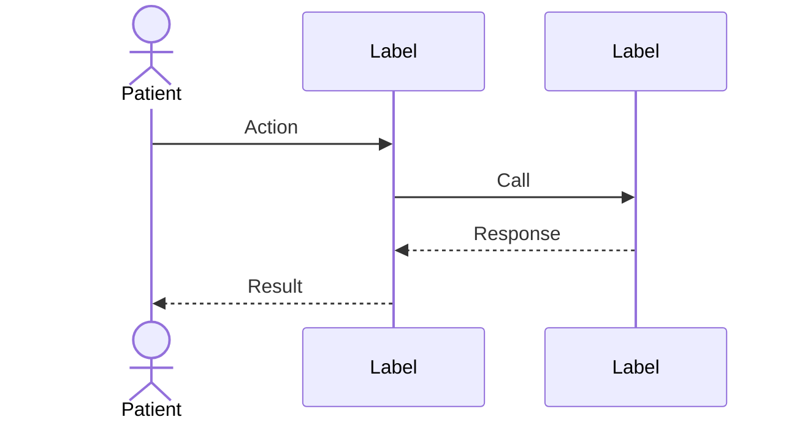

# GlucoChef — Architecture Documentation Conventions

## Toolchain

| Tool | Purpose | Output location |
|---|---|---|
| **LikeC4** | C4 structural diagrams (Context, Container, Component) | `docs/architecture/glucochef.c4` |
| **Mermaid** | Sequence diagrams and runtime flows | `docs/architecture/sequences/*.md` |
| **Markdown** | Technical narrative and diagram index | `docs/architecture/README.md` |
| **ADRs (MADR)** | Architecture decisions | `docs/decisions/ADR-NNN-title.md` |

---

## Diagram Rules

1. Each diagram answers exactly one question. State it in the `title`.
2. Maximum 7–9 principal nodes per diagram.
3. If the node limit is hit, split by C4 level or bounded context — never cram.
4. Structural diagrams (what exists and how it connects) → LikeC4.
5. Runtime flows (what happens in time order) → Mermaid sequence diagrams.
6. Internal detail, thresholds, and business rules → Markdown prose or ADR. Never inside a node label.

---

## LikeC4 — File Layout and Minimal Syntax

All three C4 levels live in **one** file: `docs/architecture/glucochef.c4`.
Views select what to render — one view per question.

```likec4
specification {
  element actor
  element system
  element container
  element component

  tag phi       // stores or processes Protected Health Information
  tag external  // outside GlucoChef's trust boundary
  tag deferred  // v2 scope; must not appear in any MVP view
}

model {
  someActor = actor 'Name' {
    description '...'
  }

  someSystem = system 'Name' {
    #external
    description '...'

    someContainer = container 'Name' {
      #phi
      technology 'Runtime · Framework'
      description '...'

      someComponent = component 'Name' within someContainer {
        technology 'module/path'
        description '...'
      }
    }
  }

  someActor -> someSystem 'Verb phrase'
}

views {
  view view_id {
    title 'L1 – <question this view answers>'
    include elementA, elementB, elementC
  }

  view view_id_2 of someContainer {
    title 'L3 – <question>'
    include *
  }
}
```

**Tag rules:**
- `#phi` — any element that stores or processes PHI must carry this tag.
- `#external` — systems outside GlucoChef's trust boundary.
- `#deferred` — model v2 items freely, but exclude them from all MVP views with `exclude element.tag == #deferred`.
- Always produce a `phi_boundary` view: `include element.tag == #phi`.

---

## Mermaid — Sequence Diagram Shell

Use `sequenceDiagram` only. No `C4Context` or `C4Container` in Mermaid.



Each sequence file lives in `docs/architecture/sequences/` and has a single diagram with a one-sentence question as its H1.

---

## ADR — MADR Template

File: `docs/decisions/ADR-NNN-short-title.md`

```markdown
# ADR-NNN — <short title>

**Date:** YYYY-MM-DD
**Status:** Accepted | Deprecated | Superseded by ADR-NNN
**Deciders:** <name>

## Context
One paragraph: the situation and the forces at play.

## Decision
One paragraph: what was decided and why.

## Consequences
- **Positive:** ...
- **Trade-off:** ...
- **Risks mitigated:** ...
```

---

## Anti-Patterns

| Anti-pattern | Rule violated |
|---|---|
| `C4Context` or `C4Container` block in Mermaid | Rule 4 |
| Business thresholds or logic inside a node label | Rule 6 |
| More than 9 nodes in a single view | Rule 2 |
| `#deferred` element included in an MVP view | Tag contract |
| PHI-bearing element without `#phi` tag | Tag contract |
| Mixing C4 levels in one view | Rule 1 — one question per diagram |